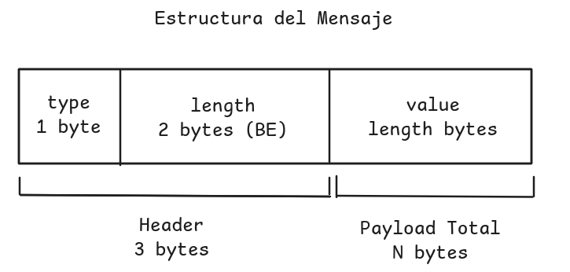
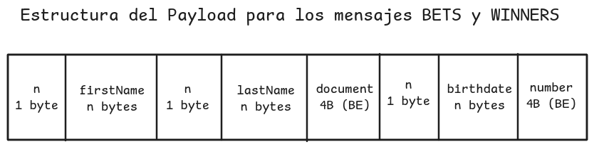

# Informe

## Protocolo de comunicación

### Encuadre de mensajes

Todo mensaje viaja con un encabezado de 3 bytes seguido de su payload:



`length` acota el payload a 65.535 bytes (el entero máximo representable con 2 bytes) y permite al receptor saber exactamente cuántos bytes leer antes de interpretar el contenido. Tanto el cliente como el servidor usan funciones de lectura y escritura que reintentan hasta completar la cantidad pedida para manejar casos de `short-read` y `short-write`.

Tipos definidos:

| Código | Tipo                 | Sentido           | Payload            | Significado |
| ------ | -------------------- | ----------------- | ------------------ |-------------|
| `0x01` | `START_TRANSMISSION` | cliente a servidor | id de agencia      | Indica el inicio de la transferencia enviando el id de la agencia. El servidor utiliza este ID para manejar a ese cliente especifico por el socket. |
| `0x02` | `BETS`               | cliente a servidor | N registros        | Envia las apuestas del cliente al servidor en batch|
| `0x03` | `END_TRANSMISSION`   | cliente a servidor | vacío              | Indica al servidor que el cliente terminó de enviar todos sus datos |
| `0x10` | `OK`                 | servidor a cliente | vacío              | Indica que el mensaje anterior fue recibido correctamente. Funciona como un ACK a nivel capa de aplicación|
| `0x11` | `WINNERS`            | servidor a cliente | N registros        |Indica los ganadores del sorteo.|
| `0x12` | `ERROR`              | servidor a cliente | vacío              |Indica que hubo un error durante el envío de mensajes|

### Representación de los registros

El payload de `BETS` y `WINNERS` usa un esquema binario fijo. Los tres campos de texto llevan un prefijo de longitud donde los dos numéricos ocupan un ancho fijo:



Los registros se concatenan sin separador, cada uno es autodelimitado por sus prefijos de longitud, y el `length` del encabezado acota el total. El decodificador consume el payload exacto y falla si sobran o faltan bytes.

El orden y el conjunto de campos espejan la estructura `Bet` del servidor. La agencia no viaja en el registro porque es información de la conexión, se envía una sola vez en `START_TRANSMISSION` y el servidor la asocia a cada apuesta que recibe por ese socket.

Decisiones de representación:
- `document` y `number` usan 4 bytes sin signo.
- `birthdate` viaja como texto y no descompuesto en año, mes y día por simplicidad a la hora de codificar y decodifiar el payload.
- Todos los enteros viajan en big endian, igual que el `length` del encabezado.

## Estrategias de concurrencia

### Modelo de ejecución

El servidor usa un hilo por cliente. El hilo aceptador corre el bucle de `accept` y delega cada socket entrante a un hilo nuevo que se encarga de atender a esa agencia: recibe el id, recibe las apuestas, espera el sorteo y devuelve los ganadores.

Se eligieron hilos y no procesos porque el trabajo es mayormente de entrada-salida: cada hilo pasa la mayor parte del tiempo bloqueado en `recv`, `send` o en la escritura del archivo de apuestas, operaciones durante las cuales CPython libera el GIL. Dentro de la [documentación oficial](https://wiki.python.org/moin/GlobalInterpreterLock) provista en el README.md dice qué:

```
Luckily, many potentially blocking or long-running operations, such as I/O, image processing, and NumPy number crunching, happen outside the GIL. Therefore it is only in multithreaded programs that spend a lot of time inside the GIL, interpreting CPython bytecode, that the GIL becomes a bottleneck.
```

Además, el estado que las agencias comparten (el archivo de apuestas y el quórum del sorteo) es memoria común entre hilos y no requiere serializarlo para cruzar un límite de proceso.

### Sincronización

Hay dos puntos de estado compartido, cada uno con su primitiva:

**El archivo de apuestas:** `store_bets` y `load_bets` no son thread safe, así que todo acceso al archivo se serializa con un `Lock`. El lock cubre tanto la escritura de cada batch recibido como la lectura completa que hace el cálculo de ganadores.

**El quórum del sorteo:** El sorteo sólo puede realizarse cuando las N agencias terminaron de enviar. Se modela con una `Barrier` de N participantes: cada hilo llama a `wait()` después de recibir su `END_TRANSMISSION` y se despierta recién cuando llega el último.

### Cierre graceful

El handler de `SIGTERM` sólo escribe un `bool` y cierra el socket de escucha. El resto del cierre lo ejecuta el hilo aceptador al salir del bucle.

| Punto de bloqueo | Cómo se desbloquea |
| ---------------- | ------------------ |
| `accept()` en el hilo aceptador | `shutdown()` sobre el socket de escucha |
| `recv()` en cada hilo de cliente | `shutdown()` sobre cada socket de cliente |
| `Barrier.wait()` con el quórum incompleto | `Barrier.abort()`, que hace fallar a todos los que esperan |

Cada hilo despertado sale por excepción pero como la bandera ya indica que el servidor está cerrando el error se loguea como cierre esperado y no como falla. Por último, el hilo aceptador hace `join` con timeout sobre los hilos de cliente y reporta los que no llegaron a cerrar.

Del lado del cliente el mecanismo es equivalente con las primitivas de Go. Una goroutine espera la señal y, al recibirla, cierra un canal `shutdown` y cierra la conexión.
